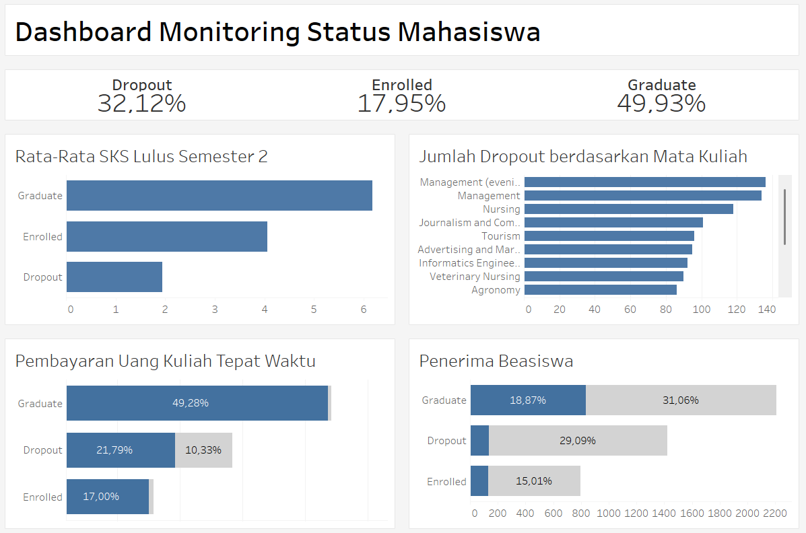

# Proyek Akhir: Menyelesaikan Permasalahan Institusi Pendidikan

## Business Understanding

Institusi pendidikan menghadapi tantangan signifikan dalam mengelola tingkat dropout mahasiswa. Tingkat dropout yang tinggi tidak hanya berdampak pada reputasi institusi tetapi juga pada keberlanjutan finansial dan kualitas pendidikan secara keseluruhan. Data menunjukkan bahwa dari total mahasiswa, 32.12% mengalami dropout, 49.93% berhasil lulus, dan 17.95% masih terdaftar. Situasi ini memerlukan pendekatan berbasis data untuk mengidentifikasi faktor-faktor penyebab dropout dan mengembangkan strategi pencegahan yang efektif.

### Permasalahan Bisnis

1. **Tingkat Dropout Mahasiswa yang Signifikan**: Angka dropout mahasiswa di Institusi mencapai **32.12%** dari total mahasiswa terdaftar. Tingkat ini menjadi perhatian serius karena berdampak negatif pada reputasi Institusi, keberlanjutan finansial, dan hilangnya potensi sumber daya manusia.
2. **Kesulitan dalam Mengidentifikasi Faktor Risiko Dropout secara Akurat**: Institusi belum memiliki pemahaman mendalam dan terukur mengenai faktor-faktor kunci (akademik, finansial, demografis, personal) yang secara signifikan berkontribusi terhadap keputusan mahasiswa untuk tidak melanjutkan studi.
3. **Ketiadaan Sistem Prediksi Dini untuk Mahasiswa Berisiko Dropout**: Saat ini, belum ada sistem proaktif yang dapat mengidentifikasi mahasiswa dengan probabilitas dropout tinggi sejak awal masa studi, sehingga intervensi seringkali terlambat dan kurang efektif.
4. **Keterbatasan dalam Monitoring Performa Akademik Mahasiswa secara Efektif dan Terintegrasi**: Proses pemantauan perkembangan akademik mahasiswa yang dapat mengarah pada risiko dropout belum terintegrasi secara optimal untuk mendukung pengambilan keputusan intervensi yang cepat dan tepat.

### Cakupan Proyek

1. **Analisis Data Eksploratif (EDA)**:
   - Analisis distribusi status mahasiswa
   - Identifikasi faktor-faktor kunci yang mempengaruhi dropout
   - Analisis hubungan antar variabel
   - Identifikasi pola dan tren dalam data

2. **Pengembangan Model Prediksi**:
   - Pembangunan model machine learning untuk prediksi dropout
   - Evaluasi dan optimasi model menggunakan berbagai algoritma (Random Forest, XGBoost, LightGBM)
   - Pengembangan pipeline preprocessing yang robust
   - Validasi model menggunakan metrik yang relevan (ROC AUC, F1-score, dll.)

3. **Visualisasi dan Dashboard**:
   - Pengembangan dashboard interaktif untuk monitoring
   - Visualisasi faktor-faktor kunci dan tren
   - Antarmuka untuk akses mudah ke insights

### Persiapan

Sumber data: Dataset mahasiswa institusi pendidikan yang mencakup informasi akademik, personal, dan finansial (4424 entri, 37 fitur).

Setup environment:

```bash
# Create virtual environment
python -m venv .venv

# Activate virtual environment
# Windows
.venv\Scripts\activate
# Linux/Mac
source .venv/bin/activate

# Install dependencies
pip install -r requirements.txt
```

## Business Dashboard

Dashboard bisnis dikembangkan menggunakan Tableau untuk memvisualisasikan insights penting:



Dashboard bisa diakses di [sini](https://public.tableau.com/app/profile/patuh/viz/Book2_17472249319740/Dashboard)

## Menjalankan Sistem Machine Learning

Prototype sistem machine learning dikembangkan menggunakan Streamlit untuk memudahkan penggunaan model prediksi. Sistem ini memungkinkan:

1. Input data mahasiswa secara manual atau melalui file CSV
2. Prediksi probabilitas dropout

Untuk menjalankan prototype:

```bash
# Pastikan virtual environment aktif
streamlit run app.py
```

Aplikasi bisa di akses di [sini](https://dashboard-masalah-pendidikan-v8m8l42gvo2qdf3mrh7jfu.streamlit.app/)

## Conclusion

Proyek ini berhasil mengembangkan solusi komprehensif untuk mengatasi permasalahan dropout di institusi pendidikan melalui:

1. Identifikasi faktor-faktor kunci yang mempengaruhi dropout, termasuk:
   - Status finansial (pembayaran kuliah, status debitur)
   - Performa akademik (nilai, rasio kelulusan)
   - Dukungan finansial (beasiswa)
   - Faktor personal (usia, status pernikahan)

2. Pengembangan model prediksi dengan performa yang baik (ROC AUC > 0.91) menggunakan XGBoost, yang dapat mengidentifikasi mahasiswa berisiko dropout secara dini.

3. Pembangunan dashboard dan prototype yang memudahkan monitoring dan pengambilan keputusan.

### Rekomendasi Action Items

1. **Program Intervensi Dini**:
   - Implementasi sistem peringatan dini berbasis model prediksi
   - Pengembangan program mentoring untuk mahasiswa berisiko tinggi
   - Penyelenggaraan workshop manajemen keuangan untuk mahasiswa

2. **Peningkatan Dukungan Finansial**:
   - Perluasan program beasiswa
   - Pengembangan skema pembayaran yang lebih fleksibel
   - Penyelenggaraan program bantuan keuangan darurat

3. **Penguatan Aspek Akademik**:
   - Pengembangan program bimbingan akademik
   - Implementasi sistem monitoring performa semesteran
   - Penyelenggaraan workshop keterampilan belajar

4. **Pengembangan Berkelanjutan**:
   - Pengumpulan data tambahan (keterlibatan ekstrakurikuler, konseling)
   - Monitoring dan evaluasi berkala model prediksi
   - Pelatihan ulang model dengan data baru secara periodik
